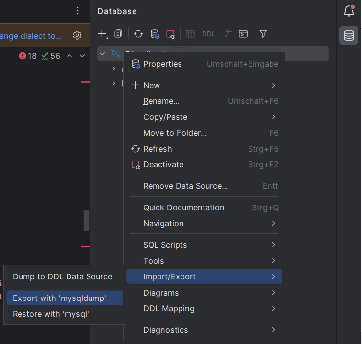
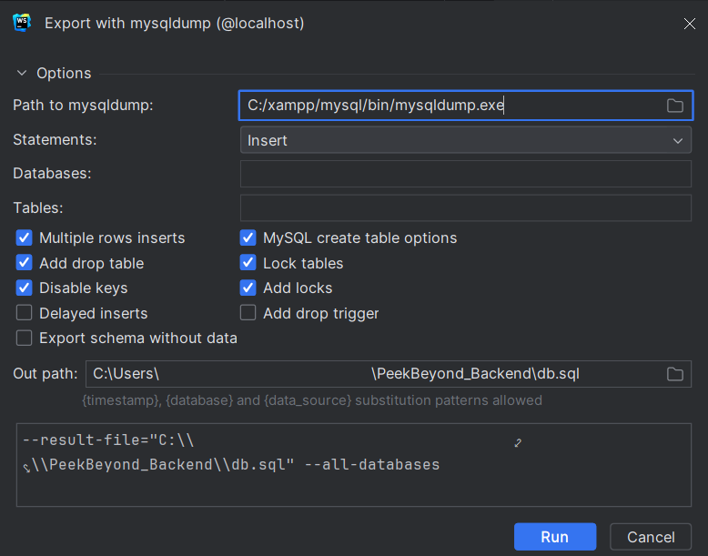

# Strapi
Im [README](strapi/README.md) von Strapi steht das Setup beschrieben
## Types
### Collection Type
Hier können Inhalte definiert werden die öfter als einmal benötigt werden. (vgl class in html)
Muss im Singular geschrieben werden, weil strapi es automatisch im plural verwendet. User -> Users

### Single Type
Nomen est omen, da können Sachen definiert werden, die nur einmal vorhanden sind (vgl id in html), also beispielsweise Seiten also eine einzelne Page

### Components
Eine Sammlung von Feldern. Es können Inhalte aber nicht gespeichert also angelegt werden. Dient als Interface in den Types, wenn es öfters gebraucht wird.
Also ein Überschriftenfeld (Überschrift (text) + Subüberschrift (text)).

## API
Zum Abfragen der Inhalte schaut des dann so aus: 'http://localhost:1337/api/projects' (all) oder  'http://localhost:1337/api/projects/1' (one by id)

## NOTA BENE
- Types können nur erstellt werden, wenn der Server im Dev-Modus gestartet worden ist.
- Immer nach dem Erstellen von einem Type ```npm run strapi ts:generate-types``` laufen lassen und den dev-server neu starten. (nur bei TS, ist noch ein bug rip)
- Man muss dann einzelne Typen in Settings->Users & Permissions plugin->Roles für die Öffentlichkeit zuerst einmal freigeben, um von außen darauf zugreifen zu können. 
- Nach dem Löschen von Types den dist Ordner löschen und den Server neu starten. (dort bleiben die Sachen fürs Adminpanel nämlich noch hinterlegt)

# Setup
## Dev
- [Node (npm)](https://nodejs.org/en/download/current)
- MySQL Server (lokal)
  - [Tutorial](https://www.youtube.com/watch?v=u96rVINbAUI)
  - Notiere dir bitte auch die Zugangsdaten, die du für dein Setup eingegeben hast, sonst kannst du keine deiner Datenbanken verwalten.
  - Beim Aufsetzten des Servers beachte, dass du bei der Authentication Method auf Legacy umstellst
- [Xampp](https://www.apachefriends.org/de/download.html) für _mysqldump.exe_ (falls du die exe schon woanders hast sind deine Pfade unten auch anders und du brauchst xampp nicht installieren)

## DB 
- Port: **3306**
- DB Name: **peek_beyond**
- DB Username: **dein username** 
- DB PW: **dein password**

### Export
#### Default
```bash
C:\xampp\mysql\bin\mysqldump -u username -p peek_beyond -r "C:\...\db.sql"
```
Wenn du nach dem PW gefragt wirst einfach "root" eingeben

##### WebStorm
Verbinde dich mit den Zugangsdaten zur Datenbank



### Import
#### Default
```shell
C:\xampp\mysql\bin\mysql -u username -p peek_beyond;
```
Dann ist man in der DB
Kopiere dass dann rein: (natürlich mit deinem Pfad zum Projekt lol)
```
source "C:\...\db.sql"
```

#### WebStorm
Verbinde dich mit den Zugangsdaten zur Datenbank


Nach "Ok" werden alle Inhalte importiert! 

Kopiere dir diese inhalte in ein .env file und ändere die Datenbank config wie du sie brauchst:
```
HOST=127.0.0.1
PORT=1337
APP_KEYS=FUsHap5bzU9xFODpDwajEw==,sZB9SMYkIU75QQ0BaGl6jw==,j1eN9ao8efymq2aFt1/Zkw==,kD+km7ytPyGbrRJzA6tEBA==
API_TOKEN_SALT=cCUkfqzkA4FVY2J/CM1OQg==
ADMIN_JWT_SECRET=YX85L5WZjJs3GpZdDDuwEQ==
TRANSFER_TOKEN_SALT=LUoQVblTogm/BLHDBHQYMA==
# Database
DATABASE_CLIENT=mysql
DATABASE_HOST=localhost
DATABASE_PORT=3306
DATABASE_NAME=peek_beyond
DATABASE_USERNAME=root
DATABASE_PASSWORD=root
DATABASE_SSL=false
JWT_SECRET=y1twvXTWYDkbuQZABCEGmg==
```

## Universal User
Mit SuperAdmin rechten:
```
alex@mustermensch.com
!4&u@Gfu}bFeT7e
```


Maybe interesting:
https://www.youtube.com/watch?v=F1f7LctorXQ
